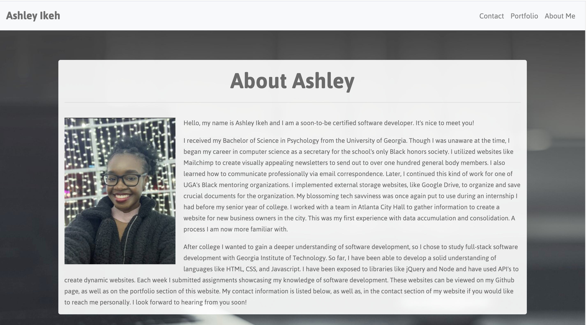

# Ashley Ikeh's Portfolio

## Table of Contents
* [Introduction](#introduction)
* [Installation](#nstallation)
* [Usage](#usage)
* [License](#license)

## Introduction

A portfolio is a crucial piece of the job search process for candidates across the globe. In 2020, a portfolio is an opportunity to showcase the highest quality work a professional has crafted during their career.
While paper portfolios are still the go-to medium for many jobseekers, it’s also important to possess a digital portfolio. As a newly trained software developer, it's only natural that I create a platform to showcase my creativity, as well as, the projects I have completed so far.

This website will supplement any job applications I submit, as well as, serve as a means of exposure to make a great first impression to those who visit my github profile or come across my website's URL. If you have any questions, comments, or concerns, please visit my website to view my contact information.

## Installation

Please [click here](https://aikeh2021.github.io/Ashley-Ikehs-Portfolio/index.html) to view the website.

## Usage

The navigation bar feature on this website is a main component! If you would like to go back and forth between pages of the website, this feature will be heavily utilized!
Just click one of the tabs to designate where you would like to visit. 

The footer will also be useful if you would like to get in contact with me or view my information hosted by other websites (e.g. LinkedIn, Github, etc). There's also a direct link to my  email.

## License

MIT License

Copyright © 2020 Ashley Ikeh

Permission is hereby granted, free of charge, to any person obtaining a copy
of this software and associated documentation files (the "Software"), to deal
in the Software without restriction, including without limitation the rights
to use, copy, modify, merge, publish, distribute, sublicense, and/or sell
copies of the Software, and to permit persons to whom the Software is
furnished to do so, subject to the following conditions:

The above copyright notice and this permission notice shall be included in all
copies or substantial portions of the Software.

THE SOFTWARE IS PROVIDED "AS IS", WITHOUT WARRANTY OF ANY KIND, EXPRESS OR
IMPLIED, INCLUDING BUT NOT LIMITED TO THE WARRANTIES OF MERCHANTABILITY,
FITNESS FOR A PARTICULAR PURPOSE AND NONINFRINGEMENT. IN NO EVENT SHALL THE
AUTHORS OR COPYRIGHT HOLDERS BE LIABLE FOR ANY CLAIM, DAMAGES OR OTHER
LIABILITY, WHETHER IN AN ACTION OF CONTRACT, TORT OR OTHERWISE, ARISING FROM,
OUT OF OR IN CONNECTION WITH THE SOFTWARE OR THE USE OR OTHER DEALINGS IN THE
SOFTWARE.
